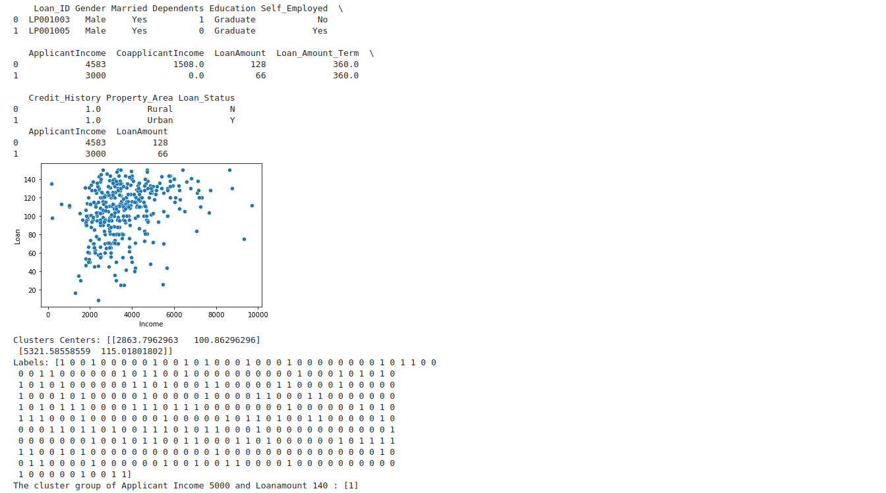

# Implementation of K-Means Clustering Algorithm
## Aim
To write a python program to implement K-Means Clustering Algorithm.
## Equipment’s required:
1.	Hardware – PCs
2.	Anaconda – Python 3.7 Installation

## Algorithm:

### Step1
import the necessary packages.

### Step2
Read the csv file.

### Step3
Scatter plot the applicant income and loan amount.

### Step4

Obtain the kmean clustring for 2 classes

### Step5
Predict the cluster group of Applicant Income and Loanamount

## Program:
```python
## Developed by: aadithyan R
## Register Number: 22000618
import pandas as pd
import matplotlib.pyplot as plt
from sklearn.cluster import KMeans
import seaborn as sns
import warnings
warnings.filterwarnings('ignore')

X1 = pd.read_csv('clustering.csv')
print(X1.head(2))
X2 = X1.loc[:, ['ApplicantIncome', 'LoanAmount']]
print(X2.head(2))

X = X2.values
sns.scatterplot(X[:,0], X[:, 1])
plt.xlabel('Income')
plt.ylabel('Loan')
plt.show()

kmean = KMeans(n_clusters=2)
kmean.fit(X)

print('Clusters Centers:', kmean.cluster_centers_)
print('Labels:', kmean.labels_)

predicted_class = kmean.predict([[5000,140]])
print('The cluster group of Applicant Income 5000 and Loanamount 140 :',predicted_class)


```
## Output:



### Insert your output

<br>

## Result
Thus the K-means clustering algorithm is implemented and predicted the cluster class using python program.